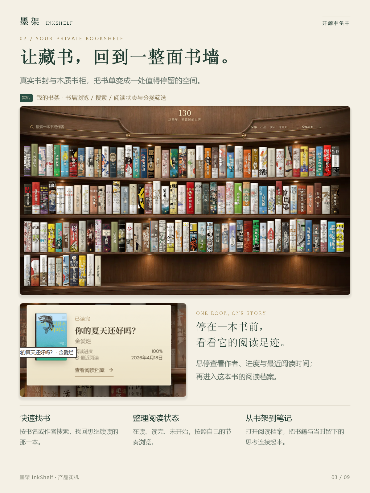
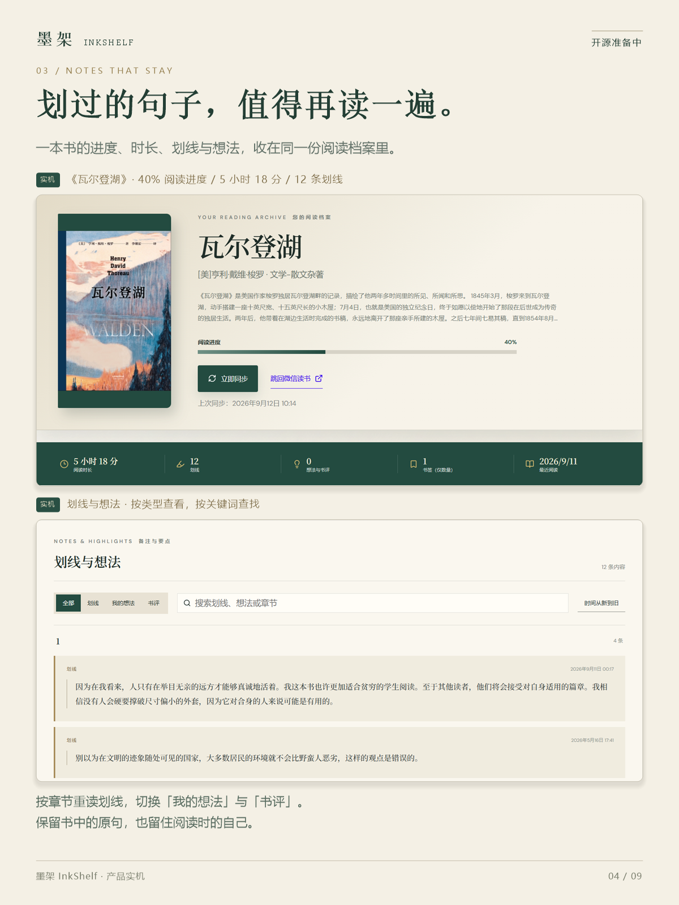
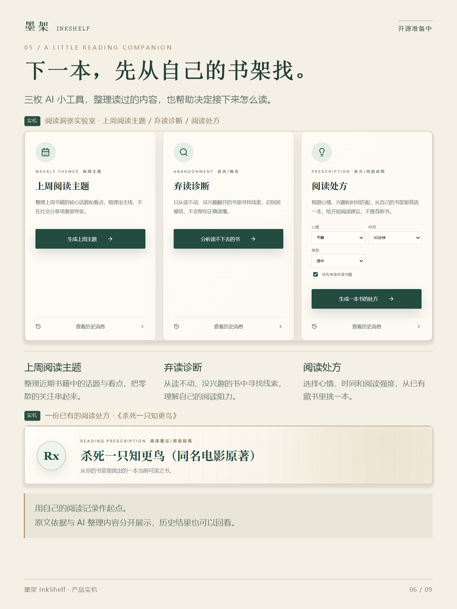
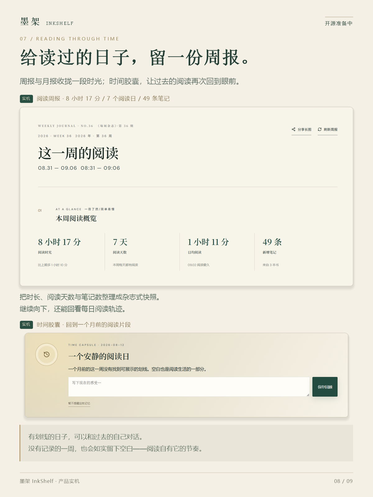
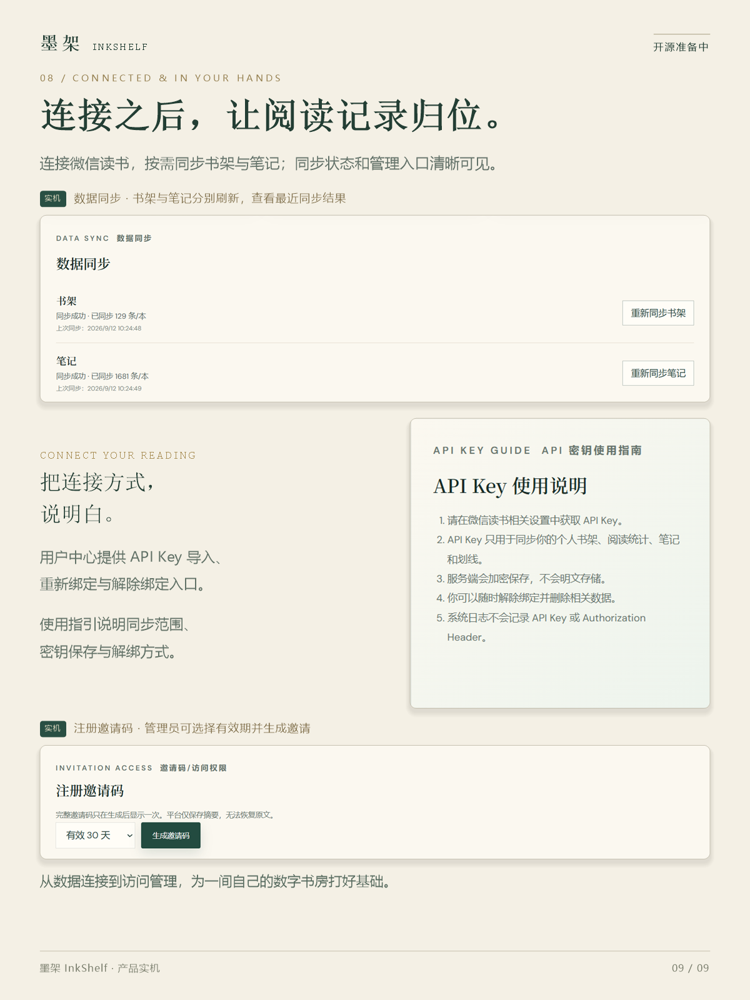
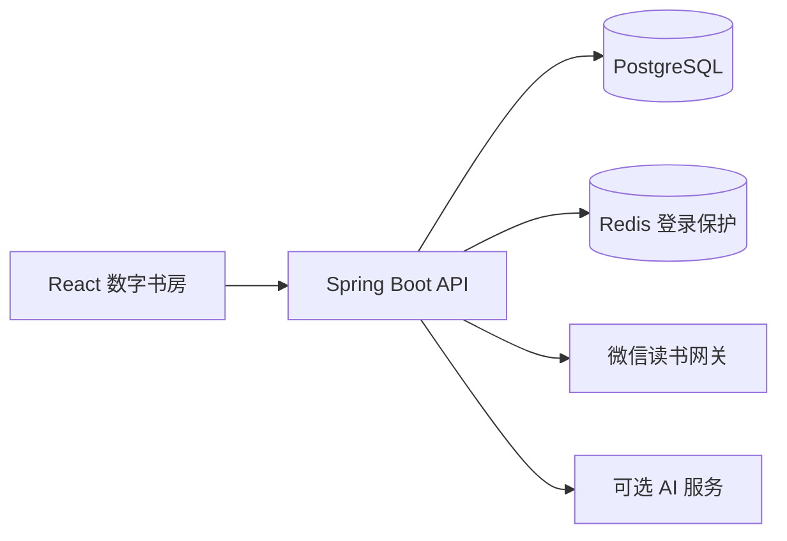

<div align="center">

# 墨架 · InkShelf

**读过的每一页，都在形成你的宇宙。**

把微信读书的书架、划线与阅读时光，整理成一座可以探索、回顾的私人数字书房。

[功能预览](#功能预览) · [本地运行](#本地运行) · [项目结构](#项目结构) · [数据与隐私](#数据与隐私)

React · TypeScript · Spring Boot · PostgreSQL · Redis


阅读，让平凡的日子也有了星光。

</div>

墨架想留下的，是书和你相遇之后的故事：在一整面书墙里找回读过的书，重读曾经划下的句子，看看一年里的阅读起伏，再顺着书与书之间的联系走向下一本。

这是可自行运行的前后端源码项目。未连接账号时可浏览内置演示数据；个人书架同步需要自己的微信读书 API Key，AI 功能需要自行配置服务端模型密钥。本仓库不附带在线服务账号、邀请码或个人数据。

## 功能预览

| 一间自己的书房 | 从记录走向洞察 |
| :--- | :--- |
| **木质书架墙**：按书名、作者搜索，按分类和阅读状态筛选；悬停查看进度，进入单书阅读档案。 | **阅读洞察与森林**：累计时长、阅读天数、书籍与笔记统计，以及过去十二个月的阅读变化。 |
| **划线与想法**：按需同步单书划线、想法和书评，按关键词与类型查找，保留章节线索。 | **AI 阅读实验室**：上周阅读主题、弃读诊断、阅读处方；从已有书架挑选下一本，并保存历史结果。 |
| **阅读星图**：用作者、分类、同期阅读和 AI 主题连接书籍；支持拖动、缩放、搜索、关系筛选与隐藏。 | **阅读记忆**：周报、月报与历史快照；通过时间胶囊重逢过去的阅读片段，写下此刻的感受。 |
| **账号与连接**：登录、邀请码注册、书架与笔记同步、连接管理及管理员入口。 | **读者留言板**：游客可阅读，登录用户可发布；页面适配桌面与手机。 |

<table>
  <tr>
    <td width="50%"></td>
    <td width="50%"></td>
  </tr>
  <tr>
    <td></td>
    <td></td>
  </tr>
  <tr>
    <td></td>
    <td></td>
  </tr>
</table>

<details>
<summary>展开查看功能总览与连接管理</summary>




</details>

图片为项目宣传与界面示例，部分带有制作时的“开源准备中”字样；图片中的账号昵称、阅读数字与书籍仅作展示，不随仓库提供对应账号或数据库。画面包含场景化宣传排版，实际界面以运行代码为准。

## 本地运行

### 先看看界面

准备 Node.js 22.12+（或满足当前 Vite 要求的更新版本），运行：

```bash
git clone https://github.com/cattttt9/mojia.git
cd mojia/frontend
npm ci
npm run dev
```

打开终端提示的本地地址，默认 `http://localhost:5173`。未连接状态使用内置演示数据；账号、真实同步、留言和 AI 请求需要后端。构建命令为 `npm run build`。

### 启动完整后端

源码当前使用 **Java 8 / Spring Boot 2.7.18**，需要 Maven、PostgreSQL 和 Redis。请自行创建空数据库 `inkshelf`，启动本地 Redis。仓库提供 Flyway 结构迁移，不包含任何数据库导出或生产部署文件。

在启动后端的终端配置以下环境变量；也可在 IDE 的运行配置中设置：

| 环境变量 | 用途 |
| :--- | :--- |
| `DATABASE_URL` | JDBC 地址，例如 `jdbc:postgresql://localhost:5432/inkshelf` |
| `DATABASE_USER` / `DATABASE_PASSWORD` | 自己的数据库账号与密码 |
| `REDIS_HOST` / `REDIS_PORT` / `REDIS_PASSWORD` | 自己的 Redis 连接信息 |
| `JWT_SECRET` | 自行生成的随机签名密钥，至少 32 字符，必填 |
| `ENCRYPTION_KEY` | 32 个随机字节的 Base64 编码，必填；保存后不可随意更换，否则已有微信读书 Key 无法解密 |
| `ALLOWED_ORIGIN` | 本地前端地址，默认 `http://localhost:5173` |
| `ZHIPU_API_KEY` | 可选；启用 AI 时填写自己的密钥，仅放后端 |
| `ZHIPU_API_BASE_URL` / `ZHIPU_MODEL` | 可选；代码默认使用智谱公开接口与 `glm-4.7`，模型权限和可用性以自己的账号为准 |

可以分别运行两次 `openssl rand -base64 32` 生成两个独立密钥。不要使用截图、示例文本或其他人的密钥。

```bash
cd backend
mvn -s settings.xml spring-boot:run
```

后端默认监听 `http://localhost:8066`。Vite 将 `/api` 代理到后端，无需改成个人服务器地址。`.env.example` 仅列出配置项，Spring Boot **不会自动读取 `.env`**；请使用环境变量，或复制 `application-local.yml.example` 为被 Git 忽略的 `application-local.yml` 并自行填写。开源版本要求显式提供 JWT 和加密密钥，不附带可复用的默认值。

### 空数据库的第一个账号

项目采用邀请码注册。数据库迁移完成后，可由本地数据库管理员在自己的空数据库执行以下一次性引导，生成随机邀请码（需要安装并获准启用 PostgreSQL `pgcrypto` 扩展）：

```sql
CREATE EXTENSION IF NOT EXISTS pgcrypto;
WITH raw AS (
  SELECT upper(encode(gen_random_bytes(6), 'hex')) AS v
), code AS (
  SELECT substr(v, 1, 4) || '-' || substr(v, 5, 4) || '-' || substr(v, 9, 4) AS v FROM raw
), inserted AS (
  INSERT INTO invitation_code (code_hash, code_masked, status, expires_at)
  SELECT encode(digest(v, 'sha256'), 'hex'),
         substr(v, 1, 4) || '-****-' || substr(v, 11, 4),
         'UNUSED', now() + interval '30 minutes'
  FROM code
  RETURNING id
)
SELECT code.v AS one_time_invitation FROM code, inserted;
```

用返回的邀请码在本地页面注册自己的账号，再将下方占位用户名替换成刚注册的用户名，由数据库管理员执行：

```sql
UPDATE app_user SET role = 'ADMIN' WHERE username = 'YOUR_REGISTERED_USERNAME';
```

重新登录后可在管理入口创建后续邀请码。不要保存或提交上述执行结果；仓库没有预置管理员、通用密码或固定邀请码。登录依赖 Redis，Redis 不可用时不会绕过登录保护。

## 项目结构

```text
frontend/
  src/                 React 页面、图表、阅读森林、书墙与星图
  public/assets/       界面运行所需的图片素材
  netlify/functions/   保留的微信读书代理源码（历史直连模式）
backend/
  src/main/java/       账号、同步、笔记、AI、星图与阅读记忆
  src/main/resources/  通用配置与 Flyway 数据库结构迁移
  src/test/            后端单元测试
docs/images/           宣传图与功能示例
```

默认运行路径为 React → Java API → PostgreSQL / Redis；微信读书同步和 AI 请求由后端访问各自上游服务。历史 Netlify 代理源码不等于一套可直接发布的站点配置。



## 数据与隐私

- 仓库只包含源码、必要静态素材、合成演示数据、通用配置模板与功能示例图。
- 不包含作者的服务器地址配置、部署脚本、数据库内容、日志、微信读书 Key、个人 AI 密钥、真实环境文件或原始开发 Git 历史。
- 微信读书 Key 在后端使用 AES-256-GCM 加密保存；个人笔记、报告等通过登录身份隔离。使用真实数据时，请在自己信任的环境运行。
- 启用 AI 后，相关阅读上下文会发送给所配置的模型服务；请在使用前阅读 `AiInsightService` 和 `ReadingStarMapAiService`，确认提交的数据范围适合自己。
- 微信读书同步依赖上游授权和接口可用性；本项目不是微信读书官方产品，不提供图书正文下载。
- 本仓库未附带作者的生产部署方案。当前基础版本、部分单实例限流、邮箱验证和密码找回等边界仍需自行评估与完善，不将本地可运行等同于完成生产安全审计。

## 开发与贡献

```bash
# frontend 目录
npm ci
npm run build

# backend 目录
mvn -s settings.xml test
```

欢迎提交界面优化、可访问性、测试或文档改进。Issue 中请使用合成数据，移除账号信息、个人笔记、请求头与密钥。修改数据库结构时添加新的 Flyway 迁移，不修改已经发布的迁移文件。

源代码采用 [MIT License](LICENSE)。图片、书封、书籍内容和第三方依赖的范围见 [素材说明](docs/ASSETS.md)。

<div align="center">

**在阅读中，遇见更大的自己。**

</div>
